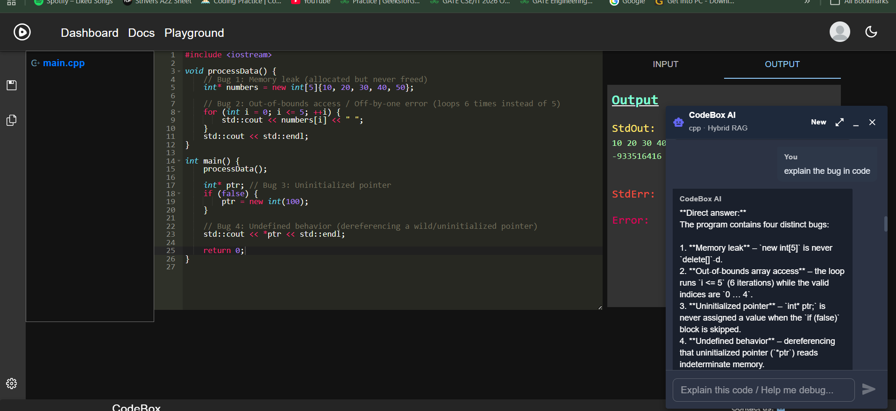

# 🌟 **Online Code Editor & Compiler**

🚀 Build, compile, and run code directly in your browser! This project combines the power of **React**, **Node.js**, **Express**, **MongoDB**, **LangChain**, **Pinecone**, and **WebContainer** to create a seamless, feature-rich online coding platform.

# Demo Video
[](https://youtu.be/I3Oth-CtypQ)
### Click the above photo to redirect to video!


## AI Demo

---

## **✨ Features**

- 🌐 **Multi-language Support**: Write and compile code in 20+ programming languages.
- 🛠️ **Project Management**: Save, edit, and delete projects with ease.
- 🔒 **User Authentication**: Secure login and sign-up with JWT.
- 🎨 **Syntax Highlighting**: Advanced coding experience with Ace Editor.
- 🤖 **AI Code Assistant**: Floating chat panel on the playground with minimize/maximize — explains code, helps debug, and answers questions using your open editor context.
- 📡 **Hybrid RAG Backend**: LangChain orchestration with BM25 + vector search (Pinecone) + LLM reranking for accurate code explanations.
- 📱 **Responsive Design**: Fully optimized for mobile, tablet, and desktop.

---

## **🤖 AI Code Assistant (Playground)**

When the code editor is open on `/playground` (**any language**):

| Control | Action |
|---------|--------|
| **FAB button** (bottom-right) | Open the AI chat panel |
| **Minimize** | Collapse to a compact bar; click bar to restore |
| **Maximize** | Expand to nearly full screen |
| **Close** | Hide panel; FAB reappears |
| **Drag header** | Reposition window (desktop) |
| **`Ctrl+Shift+A`** | Toggle open / minimize |

The assistant reads your **current Ace editor content** and, when you've saved a project, the **`codeId`** for hybrid RAG retrieval. Sign in is required.

**Components:** `components/Chat/AiChatWindow.jsx`, `AiChatPanel.jsx`, `MessageContent.jsx`  
**State:** `store/slices/chatSlice.js`  
**API helpers:** `helpers/helper.js` → `sendChatMessage`, `indexCodeForChat`

---

## **Server URL** => [CodeBox-Server](https://github.com/pratham15541/codebox-server)

---

## **🛠️ Tech Stack**

### **Frontend**
- React.js + Vite
- Redux Toolkit
- MUI + Tailwind CSS
- Ace Editor / WebContainer

### **Backend**
- Node.js + Express.js
- MongoDB (users, code, chat sessions, code chunks)
- LangChain (orchestration)
- Pinecone (vector storage)
- OpenAI-compatible API (NVIDIA Nemotron / configurable LLM)

---

## **🔌 Chat API (Backend)**

| Method | Endpoint | Description |
|--------|----------|-------------|
| `POST` | `/api/chat` | Send a message; returns AI explanation |
| `POST` | `/api/chat/index` | Chunk and index saved code into Pinecone |
| `GET` | `/api/chat/sessions` | List chat sessions |
| `GET` | `/api/chat/messages?sessionId=` | Get session messages |
| `GET` | `/api/chat/chunks?codeId=` | View indexed chunks |

All chat routes require `Authorization: Bearer <JWT>`.

---

## **⚙️ Environment Variables**

### Frontend (`codebox-client/.env`)
```
VITE_SERVER_DOMAIN=http://localhost:8000
VITE_PROXY_URL=...
VITE_API_RUNNER_URL=...
VITE_RUNNER_API_TOKEN=...
```

### Backend (`codebox-server/.env`)
```
MONGODB_URI=...
JWT_SECRET=...
PINECONE_API_KEY=...
PINECONE_INDEX=codebox-code-chunks
AI_API_KEY=...
AI_MODEL=...
AI_BASE_URL=...
EMBEDDING_MODEL=...
```

---

Support me and give ⭐ and ❤️. @pratham15541
